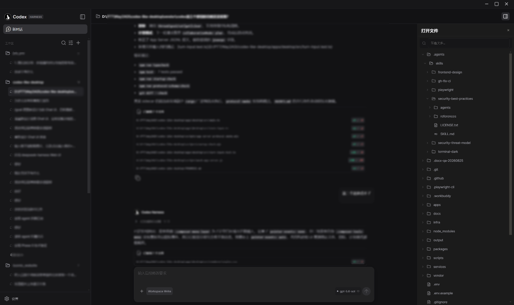
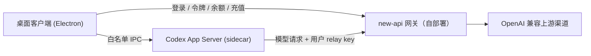

# Codex Harness

一个开源的 AI 编程桌面客户端（Windows / macOS）：内置 Codex App Server，连接本地项目完成对话、文件修改和命令审批；模型请求统一经过你自部署的 [new-api](https://github.com/QuantumNous/new-api) 网关（OpenAI 兼容），账号登录、余额与充值全部复用网关现有能力——客户端本地没有任何后端进程。

> 项目与 OpenAI 无官方关系；上游基于固定 commit 的 [openai/codex](https://github.com/openai/codex)（`25a6e31`）开源代码，产品使用自有品牌。
>
> **与官方 Codex 完全隔离**：内置 sidecar 使用独立的 `CODEX_HOME`（应用数据目录下的 `codex-home`）运行，不读写官方 Codex CLI 的 `~/.codex`——会话历史、登录态、配置、插件互不污染；也不要求、不依赖用户安装 Codex CLI，卸载本产品不影响官方 CLI 的任何数据。



## 功能特性

- **对话式编程**：流式回复、推理过程、工具调用折叠展示；目标（goal）与计划模式。
- **本地执行 + 审批边界**：文件读取、修改和命令执行都发生在用户本机，执行命令 / 改文件 / 申请权限前先弹卡征求同意，审批卡内联在会话流里。
- **内置 App Server**：用户只装一个安装包，不需要自行安装 Codex CLI、Node.js 或 Rust。
- **会话管理**：按项目分组、置顶、重命名、最近会话、搜索；本地持久化，重启可恢复。
- **账号与计费**：用户名或邮箱 + 密码登录（首次登录自动注册，是否开放注册由网关决定）；余额以美元展示，充值跳转网关控制台。每个用户使用自动创建的专属 relay key，计费与扣减全部在网关侧完成。
- **密钥处理**：密码只在登录瞬间经过内存，绝不落盘；relay key 经系统级加密（Electron safeStorage）存储；供应商渠道密钥只存在于网关服务端。

## 架构



- 客户端不含后端：登录（`/api/user/login`，用户名与邮箱都可匹配）、relay key 管理（`/api/token/*`）、余额（`/api/user/self`、`/api/usage/token/`）与模型请求（`/v1/responses`）全部直连网关现有接口，接口面固定在 new-api v1.0.0-rc.25。
- 首次登录后客户端自动创建一个名为 `codex-harness` 的专属 relay key（不限量、走用户级额度）；已存在则直接复用。
- 上游 Codex 固定在 commit `25a6e31`，升级须先过协议、流式、审批和计费回归。

| 目录 | 用途 |
| --- | --- |
| `apps/desktop` | Electron + React + TypeScript 桌面客户端（含 new-api 网关客户端） |
| `services/api` / `services/model-gateway` / `services/billing` | 自建后端路径的技术验证实现（JWT 登录、模型网关、持久账本、支付回调），保留供后续阶段使用；当前桌面流程不依赖它们 |
| `packages/protocol` / `packages/shared` | 共享协议类型与 JWT 等公共工具 |
| `vendor/codex` | 固定版本的上游 Codex 源码（构建 sidecar 用） |
| `apps/admin` / `infra` / `scripts` / `docs` | 管理后台、部署依赖、构建脚本与文档（部分仍在建设中） |

## 本地部署

### 准备

- Node.js 18+（Windows / macOS 均可）
- 一个已部署的 new-api 网关（其他 OpenAI 兼容网关需兼容上述登录 / 令牌 / Responses 接口）
- Codex 二进制：检出上游源码到固定 commit `25a6e31` 放到 `vendor/codex/codex-rs` 后执行 `npm run build:sidecar`（需 Rust 工具链，产物输出到 `apps/desktop/resources/`）；或用 `CODEX_SIDECAR_PATH` 指向已有的 codex 二进制

### 配置并启动（单进程）

```powershell
git clone <本仓库>
cd codex-like-desktop
npm install
npm run typecheck       # 编译全部 TS 包 + renderer
copy .env.example .env  # 填入你的网关配置
npm run dev
```

`.env` 关键配置（全部走环境变量，仓库内不含任何真实网关地址）：

| 环境变量 | 说明 |
| --- | --- |
| `NEWAPI_BASE_URL` | 网关地址（必填，如 `https://new-api.example.com`） |
| `NEWAPI_TOPUP_URL` | 充值页，默认 `{NEWAPI_BASE_URL}/console/topup` |
| `NEWAPI_QUOTA_PER_UNIT` | 额度→美元换算（new-api 默认 500000） |
| `NEWAPI_TOKEN_NAME` | 自动创建的 relay key 名，默认 `codex-harness` |
| `NEWAPI_DEFAULT_MODEL` | 网关目录不可用时的兜底模型 |

启动后在登录页输入网关账号（用户名或邮箱 + 密码）→ 客户端自动创建 / 复用 relay key 并注入 sidecar → 开始对话。

> **网关直连模式**：同时设置 `WAY2AGI_GATEWAY_URL`（如 `https://<你的网关>/v1`）+ `WAY2AGI_GATEWAY_TOKEN`（new-api 令牌）会跳过登录门直接注入 sidecar，适合单独调试网关或 CI。

### 打包

```powershell
npm run dist:win   # build:all + electron-builder 打 Windows 安装包
```

打包前必须先 `npm run build:sidecar`，安装包会携带真实 sidecar；发布版不依赖全局 Codex CLI、PATH 或用户本机的任何运行时。macOS 打包与自动更新链路仍在开发中（见下）。

## 开发与测试

| 命令 | 说明 |
| --- | --- |
| `npm test` | billing / model-gateway / api / shared / 桌面端（new-api 客户端、输入构造）自动化测试 |
| `npm run startup-check` | 构建产物 + mock sidecar 握手 + 启动检查 |
| `npm run protocol-schema-check` | 校验固定上游 schema 仍包含所需方法 |
| `npm run protocol-smoke` | 存在真实 sidecar 时验证 initialize / 流式协议 |
| `npm run build:sidecar` | 构建上游 `25a6e31` 的 codex 二进制（需 cargo） |

## 项目状态与已知限制

- ✅ 已打通：密码登录（首登即注册）、流式对话、文件修改与命令审批、按用户 relay key 计费、余额展示、充值跳转、会话持久化与恢复。
- 🚧 进行中：运营后台、macOS 打包、自动更新与回滚；`services/` 下的自建后端路径（真实渠道支付、短信验证码等）保留待后续阶段。
- ⚠️ 已知限制：
  - 网关侧删除或禁用 `codex-harness` 令牌后，客户端会在下次启动校验失败并回到登录页。
  - 网关登录会话过期时，余额退化为 relay key 维度（不限量令牌显示「不限量」而非用户余额）。
  - `services/` 自建后端仍为内存用户库 + 单进程文件账本（网关按单实例部署假设），仅作为后续自建路径的参考实现。

## 安全与合规原则

1. 密码只在登录请求中经过内存，不持久化；relay key 经 safeStorage 加密存储，不进日志。
2. 供应商渠道 API Key 只保存在网关服务端，不进入桌面包、日志或客户端配置。
3. 余额与扣费以网关服务端为最终裁定，客户端金额仅作展示。
4. 本地命令执行保留用户审批边界，不做远程执行或远程沙箱。
5. 仓库不含任何真实网关地址与密钥，配置全部走环境变量；不为了通过测试关闭审批、账单或签名校验。

## 许可

[MIT](LICENSE)
