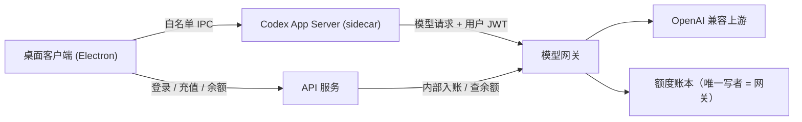

# Codex Harness

一个开源的 AI 编程桌面客户端（Windows / macOS）：内置 Codex App Server，连接本地项目完成对话、文件修改和命令审批；模型请求统一经过自建的 OpenAI 兼容网关，配合账号登录与「套餐额度 + 按 token 计费」的服务端账本。

> 项目与 OpenAI 无官方关系；上游基于固定 commit 的 [Codex 开源代码](vendor/codex)，产品使用自有品牌。

<!-- TODO(截图)：把桌面截图放到 docs/images/desktop.png 后删除本行 -->


## 功能特性

- **对话式编程**：流式回复、推理过程、工具调用折叠展示；目标（goal）与计划模式。
- **本地执行 + 审批边界**：文件读取、修改和命令执行都发生在用户本机，执行命令 / 改文件 / 申请权限前先弹卡征求同意，审批卡内联在会话流里。
- **内置 App Server**：用户只装一个安装包，不需要自行安装 Codex CLI、Node.js 或 Rust。
- **会话管理**：按项目分组、置顶、重命名、最近会话、搜索；本地持久化，重启可恢复。
- **账号与计费**：手机号 / 邮箱验证码登录；套餐额度优先抵扣、超额按实际 token 计费；微信 / 支付宝扫码充值；余额与扣费以服务端账本为准。
- **模型网关**：OpenAI 兼容 Responses API，JWT 鉴权、限流、失败不计费、用量采集，供应商 API Key 只存在服务端。

## 架构



- 客户端不保存供应商长期密钥，所有模型请求必须经网关转发。
- 账本的唯一写者是网关进程；API 只通过内部端点充值 / 读余额；支付以服务端验签回调结果为准。
- 上游 Codex 固定在 commit `25a6e31`，升级须先过协议、流式、审批和计费回归。

| 目录 | 用途 |
| --- | --- |
| `apps/desktop` | Electron + React + TypeScript 桌面客户端 |
| `services/api` | 认证、账户、充值订单、支付回调 |
| `services/model-gateway` | OpenAI 兼容模型网关与用量扣费 |
| `services/billing` | 套餐、余额、流水的持久化账本 |
| `packages/protocol` / `packages/shared` | 共享协议类型与 JWT 等公共工具 |
| `vendor/codex` | 固定版本的上游 Codex 源码（构建 sidecar 用） |
| `apps/admin` / `infra` / `scripts` / `docs` | 管理后台、部署依赖、构建脚本与文档（部分仍在建设中） |

## 本地部署

### 准备

- Node.js 18+（Windows / macOS 均可）
- Rust 工具链（仅构建真实 sidecar 时需要；仓库根目录执行）

```powershell
git clone <本仓库>
cd codex-like-desktop
npm install
npm run build:sidecar   # 构建固定上游 commit 的 codex 二进制到 apps/desktop/resources/
npm run typecheck       # 编译全部 TS 包 + renderer
```

### 启动三个进程

**1. 模型网关（默认端口 4310）**

```powershell
$env:GATEWAY_JWT_SECRET="<与 API 一致的随机密钥>"
$env:GATEWAY_INTERNAL_SECRET="<与 API 一致的随机密钥>"
$env:GATEWAY_UPSTREAM_BASE_URL="https://<你的 OpenAI 兼容上游>/v1"
$env:GATEWAY_UPSTREAM_API_KEY="<上游供应商 Key>"
$env:GATEWAY_LEDGER_PATH="D:\data\ledger.json"   # 持久账本；不设则用内存假账本
node services/model-gateway/dist/server.js
```

**2. 认证 / 计费 API（默认端口 4320）**

```powershell
$env:GATEWAY_JWT_SECRET="<与网关一致>"
$env:GATEWAY_INTERNAL_SECRET="<与网关一致>"
$env:GATEWAY_INTERNAL_URL="http://127.0.0.1:4310"
$env:PAYMENT_CALLBACK_SECRET="<支付回调 HMAC 密钥>"
$env:API_GATEWAY_BASE_URL="http://127.0.0.1:4310/v1"
$env:GATEWAY_MODELS="gpt-5.6-sol,gpt-5.5"
node services/api/dist/server.js
```

开发模式下 `POST /auth/request-code` 直接返回验证码（`AUTH_DEV_CODE`，默认 `888888`）；充值可用「模拟支付」按钮入账（`API_ENABLE_MOCK_PAYMENTS=false` 关闭）。定价由 `API_CREDITS_PER_CNY` 控制，默认 10 万额度 = 1 元。

**3. 桌面客户端**

```powershell
$env:API_BASE_URL="http://127.0.0.1:4320"
npm run dev
```

启动后登录 → 模型目录和网关地址经 `/client/bootstrap` 下发给客户端 → sidecar 携带用户 JWT 经网关发起对话。

> bash / Linux 用户把 `$env:X="..."` 换成 `export X=...` 即可。
>
> **免后端演示模式**：不设 `API_BASE_URL` 直接 `npm run dev`，桌面端会内嵌一个 mock 网关（无鉴权、假扣费），用于 UI 走查和协议验证。
>
> **网关直连模式**：设 `WAY2AGI_GATEWAY_URL` + `WAY2AGI_GATEWAY_TOKEN`（可用 `node scripts/dev-issue-token.mjs` 签发）会优先于登录会话注入 sidecar，适合单独调试网关。

### 打包

```powershell
npm run dist:win   # build:all + electron-builder 打 Windows 安装包
```

打包前必须先 `npm run build:sidecar`，安装包会携带真实 sidecar；发布版不依赖全局 Codex CLI、PATH 或用户本机的任何运行时。macOS 打包与自动更新链路仍在开发中（见下）。

## 开发与测试

| 命令 | 说明 |
| --- | --- |
| `npm test` | billing / model-gateway / api / shared 自动化测试 |
| `npm run startup-check` | 构建产物 + mock sidecar 握手 + 启动检查 |
| `npm run protocol-schema-check` | 校验固定上游 schema 仍包含所需方法 |
| `npm run protocol-smoke` | 存在真实 sidecar 时验证 initialize / 流式协议 |
| `npm run build:sidecar` | 构建上游 `25a6e31` 的 codex 二进制（需 cargo） |

## 项目状态与已知限制

- ✅ 已打通：登录、流式对话、文件修改与命令审批、网关扣费、持久账本、充值订单与验签回调、客户端充值 UI。
- 🚧 进行中：真实渠道支付、短信 / 邮件验证码、运营后台、macOS 打包、自动更新与回滚。
- ⚠️ 已知限制：API 的用户与 refresh token 目前是内存存储（重启失效）；账本为单进程文件存储（网关按单实例部署假设）；生产环境请替换为集中存储后再水平扩展。

## 安全与合规原则

1. 模型供应商长期 API Key 只保存在服务端，不进入桌面包、日志或客户端配置。
2. 余额、扣费、退款以服务端账本为最终裁定，客户端金额仅作展示。
3. 支付订单必须服务端验签、幂等入账。
4. 本地命令执行保留用户审批边界，不做远程执行或远程沙箱。
5. 不提交任何真实密钥；不为了通过测试关闭审批、账单或签名校验。

## 文档

- [架构说明](docs/architecture.md)
- [上游同步规则](docs/upstream-sync.md)
- [Phase 0 验收记录](docs/phase-0.md)

## 许可

尚未确定开源许可证；在添加 LICENSE 文件前，仓库内代码默认保留所有权利，请勿直接分发。
